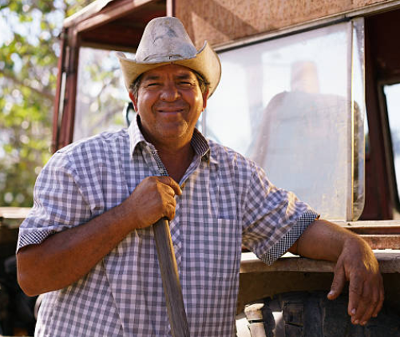
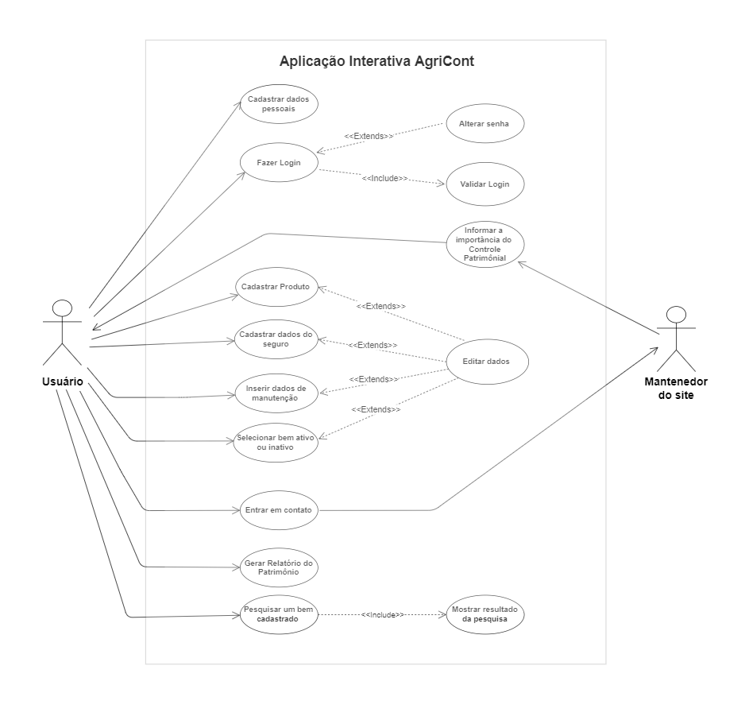

# Especificações do Projeto

Pré-requisitos: <a href="1-Documentação de Contexto.md"> Documentação de Contexto</a>

Definição do problema e ideia de solução a partir da perspectiva do usuário. É composta pela definição do  diagrama de personas, histórias de usuários, requisitos funcionais e não funcionais além das restrições do projeto.

Apresente uma visão geral do que será abordado nesta parte do documento, enumerando as técnicas e/ou ferramentas utilizadas para realizar a especificações do projeto

## Personas

|    Susy Thiemy Takamura   | Informações:                       |                                        |
|--------------------|------------------------------------|----------------------------------------|
|| **Idade:** 29 anos   **Ocupação:** Engenheira Agrônoma, Gerente na propriedade da família.|**Aplicativos:** <ul>● Instagram  ● WhatsApp  ● Facebook  ● NFS-e App  ● Aplicativo de Banco</ul>|
|**Motivações:** <ul>● Apaixonada pela profissão decidiu cursar agronomia, pois desde pequena sempre teve contato com a rotina de trabalho no sítio da família, que planta hortaliças;    ● Após sair do seu último emprego em corporação, decidiu assumir os negócios da família, pois quer transformar suas experiências acadêmicas e profissionais em crescimento dos negócios da família. </ul>|**Frustrações:** <ul>● Precisa solicitar um financiamento no Banco para adquirir uma nova máquina, porém como sua família não tem um controle patrimonial ela não consegue saber o que exatamente pode dar de garantia para a instituição;    ● No passado ela participou de um grande prejuízo financeiro, pois sua família perdeu um trator por manutenção incorreta.|**Hobbies/Histórias:** <ul>● Andar a cavalo;  ● Tocar violão;   ● Participar de Feiras Agropecuárias.</ul>|

|    Luiz Machado  | Informações:                       |                                        |
|--------------------|------------------------------------|----------------------------------------|
|| **Idade:** 20 anos   **Ocupação:** Estagiário de agronomia|**Aplicativos:** <ul>● Skype  ● WhatsApp  ● Messenger  ● Youtube  ● Facebook</ul>|
|**Motivações:** <ul>● Busca por reconhecimento na empresa e crescimento na carreira;    ● Deseja ter a possibilidade de pesquisar informações sobre determinada máquina, para implementar possíveis melhorias em seu hardware.  </ul>|**Frustrações:** <ul>● Seu chefe solicitou uma parafusadeira para realizar um conserto, porém um outro funcionário informou que aquela ferramenta havia sido vendida a meses atrás e não havia nenhum registro dessa transação;    ● Não ter um sistema que cadastre o valor de depreciação do bem.|**Hobbies/Histórias:** <ul>● Gosta de participar de feiras e eventos, pois assim conhece as novas tendências que podem otimizar as operações do campo. Em seu tempo livre gosta de jogar com amigos no computador. </ul>|

|    Carlos Gomes  | Informações:                       |                                        |
|--------------------|------------------------------------|----------------------------------------|
|| **Idade:** 40 anos   **Ocupação:** Pequeno empresário agrícola|**Aplicativos:** <ul>● Instagram  ● Facebook  ● Aplicativos de Banco</ul>|
|**Motivações:** <ul>● Ele é um amante da natureza e deseja que sua empresa seja pioneira na produção de vegetais e frutas de alta qualidade e sem utilização de agrotóxicos.   ● Reduzir gastos com equipamentos para poder investir em novas tecnologias. </ul>|**Frustrações:** <ul>● Recentemente teve um sinistro na empresa, e decidiu fazer um seguro, porém não tinha a relação do patrimônio.   ● Dificuldade de manter um controle das notas fiscais dos equipamentos da empresa.|**Hobbies/Histórias:** <ul>● Estudar meios de plantação mais sustentáveis. </ul>|
 
 
 |    Stephanie Oliveira  | Informações:                       |                                        |
|--------------------|------------------------------------|----------------------------------------|
|| **Idade:** 25 anos   **Ocupação:** Tecnóloga em Silvicultura, trabalha em uma empresa de reflorestamento sustentável|**Aplicativos:** <ul>● Instagram  ● Facebook  ● Google Maps ● Be My Eyes  ● Eye-D  </ul>|
|**Motivações:** <ul>● Continuar atuando na Silvicultura clássica, pois acredita na produção que preserve o meio ambiente.   ● Estará à frente do projeto para plantar uma espécie de árvore chamada Taxi-Branco. </ul>|**Frustrações:** <ul>● Ela será responsável pelo controle dos equipamentos que serão utilizados neste novo projetos, porém possui deficiência visual com perda parcial e tem dificuldade de encontrar programas que tenham Interação por voz e som para deficientes visuais.   ● Como faz trabalhos externos precisa de um programa que possa ser visualizado em telas menores.|**Hobbies/Histórias:** <ul>● Gosta de aprender sobre árvores nativas do Brasil.  ● Gosta de assistir documentários relacionados à preservação do meio ambiente.   ● Gosta de jogar jogos de tabuleiro.  ● Quando criança teve toxoplasmose e a doença se alojou em seus dois olhos, por isso do lado direito possui 90% da visão e no esquerdo apenas 50%.  </ul>|

## Histórias de Usuários

Com base na análise das personas forma identificadas as seguintes histórias de usuários:

|EU COMO... `PERSONA`| QUERO/PRECISO ... `FUNCIONALIDADE` |PARA ... `MOTIVO/VALOR`                 |
|--------------------|------------------------------------|----------------------------------------|
|Susy Thiemy |Quer um sistema, no qual possa se cadastrar e ter login         | Para acessar informações e dados da sua empresa.                |
|Susy Thiemy |Quer um sistema que possa verificar o patrimônio por categoria como: maquinário, veículos, ferramentas e informática      | Para poder fazer a gestão patrimonial da propriedade.    |
|Susy Thiemy |Poder verificar quando foi a última data de manutenção do equipamento | Para não ter prejuízos financeiros.  |
|Susy Thiemy |Poder conseguir entrar em contato com a equipe de atendimento.     |  Para sanar dúvidas  |
|Luiz Machado  | Quer que o sistema cadastre e pesquise se o equipamento está em operação ou não    | Para evitar gastos com compras desnecessárias     |
|Luiz Machado  | Quer que o sistema cadastre o valor da depreciação do bem   | Para saber quando será a melhor época para vender e comprar outro  |
| Carlos Gomes |   Manter uma lista com a relação de todo patrimônio da empresa. | Contratar um seguro.   |
| Carlos Gomes | Poder cadastrar dados da apólice de seguro.  |  Para saber quais equipamentos estão ou não no seguro.   |
| Carlos Gomes | Manter um cadastro dos equipamentos da empresa com os dados da nota fiscal.  |  Facilitar o controle patrimonial.  |
|Stephanie Oliveira  |   |    |
|Stephanie Oliveira  |   |    |

Apresente aqui as histórias de usuário que são relevantes para o projeto de sua solução. As Histórias de Usuário consistem em uma ferramenta poderosa para a compreensão e elicitação dos requisitos funcionais e não funcionais da sua aplicação. Se possível, agrupe as histórias de usuário por contexto, para facilitar consultas recorrentes à essa parte do documento.

> **Links Úteis**:
> - [Histórias de usuários com exemplos e template](https://www.atlassian.com/br/agile/project-management/user-stories)
> - [Como escrever boas histórias de usuário (User Stories)](https://medium.com/vertice/como-escrever-boas-users-stories-hist%C3%B3rias-de-usu%C3%A1rios-b29c75043fac)
> - [User Stories: requisitos que humanos entendem](https://www.luiztools.com.br/post/user-stories-descricao-de-requisitos-que-humanos-entendem/)
> - [Histórias de Usuários: mais exemplos](https://www.reqview.com/doc/user-stories-example.html)
> - [9 Common User Story Mistakes](https://airfocus.com/blog/user-story-mistakes/)

## Requisitos

As tabelas que se seguem apresentam os requisitos funcionais e não funcionais que detalham o escopo do projeto.

### Requisitos Funcionais

|ID    | Descrição do Requisito  | Prioridade |
|------|-----------------------------------------|----|
|RF-001|  O sistema deve permitir que o usuário se cadastre na aplicação.   |  Alta   | 
|RF-002|  O sistema deve permitir que o usuário faça o login.   |  Alta   |
|RF-003|  O sistema deve permitir que o usuário altere a senha do seu login.    |  Média    |
|RF-004|  O sistema deve permitir que o usuário cadastre o patrimônio por categoria como: maquinário, veículos, ferramentas e informática       |  Alta  |
|RF-005|  O sistema deve permitir que o usuário insira a última data de manutenção.   |  Alta  |
|RF-006|  O site deve permitir que o usuário entre em contato com a AgriCont através da página fale conosco.   |  Baixa  |
|RF-007|  O site deve permitir que o usuário informe se o equipamento está ativo ou inativo.   |  Alta   |
|RF-008|  O site deve permitir que o usuário pesquise as informações cadastradas de cada patrimônio   |  Alta   |
|RF-009|  O site deve permitir que o usuário cadastre o valor da depreciação do patrimônio.   |  Alta   |
|RF-010|  O site deve informar sobre a importância de um controle patrimonial.   |  Alta   |
|RF-011|  O sistema deve permitir que o usuário cadastre os equipamentos da empresa com os dados da nota fiscal. |  Alta  |
|RF-012|  O sistema deve permitir que o usuário cadastre os dados da apólice de seguro. |  Alta  |
|RF-013|  O sistema deve gerar um relatório com todo patrimônio da empresa. |  Alta  | 
|RF-014|  O sistema deve permitir que o usuário edite todas as informações do cadastro do patrimônio. | Média |
### Requisitos não Funcionais

|ID     | Descrição do Requisito  |Prioridade |
|-------|-------------------------|----|
|RNF-001| O sistema deve ser responsivo para rodar em um dispositivos móvel | MÉDIA | 
|RNF-002| Deve processar requisições do usuário em no máximo 3s |  BAIXA | 
|       |                                                       |        | 
|       |                                                       |        | 
|       |                                                       |        | 
|       |                                                       |        | 
|       |                                                       |        | 
|       |                                                       |        | 
|       |                                                       |        | 

Com base nas Histórias de Usuário, enumere os requisitos da sua solução. Classifique esses requisitos em dois grupos:

- [Requisitos Funcionais
 (RF)](https://pt.wikipedia.org/wiki/Requisito_funcional):
 correspondem a uma funcionalidade que deve estar presente na
  plataforma (ex: cadastro de usuário).
- [Requisitos Não Funcionais
  (RNF)](https://pt.wikipedia.org/wiki/Requisito_n%C3%A3o_funcional):
  correspondem a uma característica técnica, seja de usabilidade,
  desempenho, confiabilidade, segurança ou outro (ex: suporte a
  dispositivos iOS e Android).
Lembre-se que cada requisito deve corresponder à uma e somente uma
característica alvo da sua solução. Além disso, certifique-se de que
todos os aspectos capturados nas Histórias de Usuário foram cobertos.

## Restrições

O projeto está restrito pelos itens apresentados na tabela a seguir.

|ID| Restrição                                             |
|--|-------------------------------------------------------|
|RE-01| O projeto deverá ser entregue até o final do semestre |
|RE-02| A equipe não pode subcontratar o desenvolvimento do trabalho.|       |

Enumere as restrições à sua solução. Lembre-se de que as restrições geralmente limitam a solução candidata.

> **Links Úteis**:
> - [O que são Requisitos Funcionais e Requisitos Não Funcionais?](https://codificar.com.br/requisitos-funcionais-nao-funcionais/)
> - [O que são requisitos funcionais e requisitos não funcionais?](https://analisederequisitos.com.br/requisitos-funcionais-e-requisitos-nao-funcionais-o-que-sao/)

## Diagrama de Casos de Uso

O diagrama de casos de uso é o próximo passo após a elicitação de requisitos, que utiliza um modelo gráfico e uma tabela com as descrições sucintas dos casos de uso e dos atores. Ele contempla a fronteira do sistema e o detalhamento dos requisitos funcionais com a indicação dos atores, casos de uso e seus relacionamentos. 

As referências abaixo irão auxiliá-lo na geração do artefato “Diagrama de Casos de Uso”.

> **Links Úteis**:
> - [Criando Casos de Uso](https://www.ibm.com/docs/pt-br/elm/6.0?topic=requirements-creating-use-cases)
> - [Como Criar Diagrama de Caso de Uso: Tutorial Passo a Passo](https://gitmind.com/pt/fazer-diagrama-de-caso-uso.html/)
> - [Lucidchart](https://www.lucidchart.com/)
> - [Astah](https://astah.net/)
> - [Diagrams](https://app.diagrams.net/)
