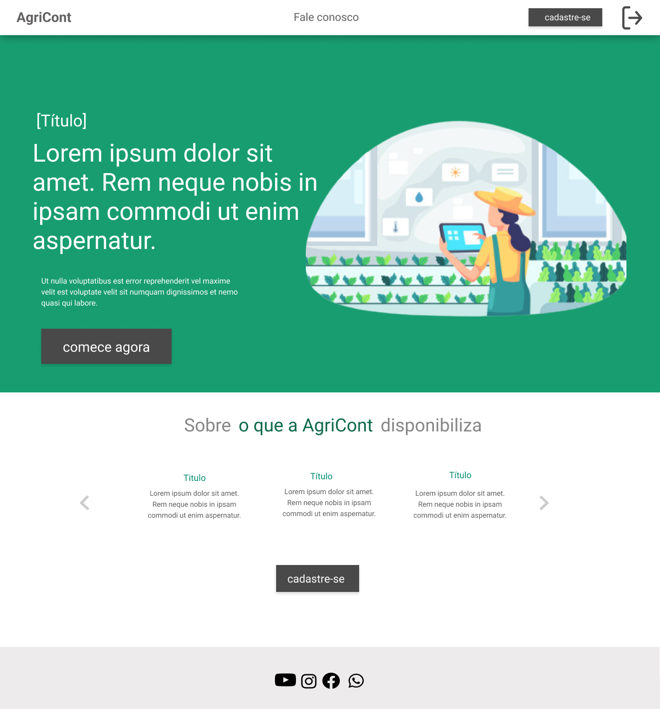
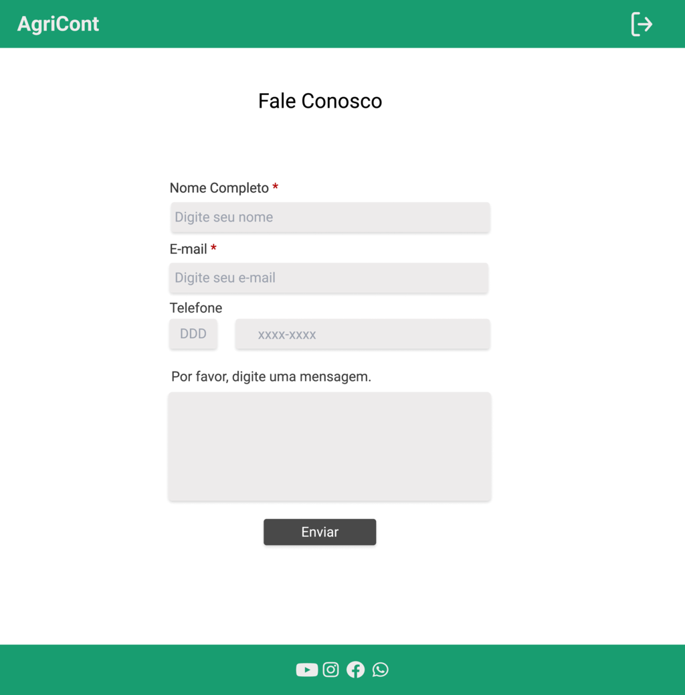
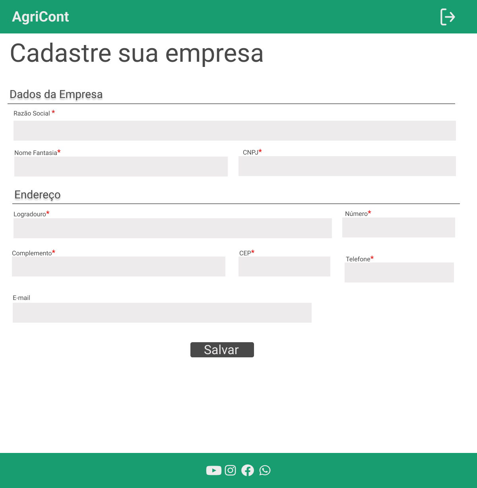
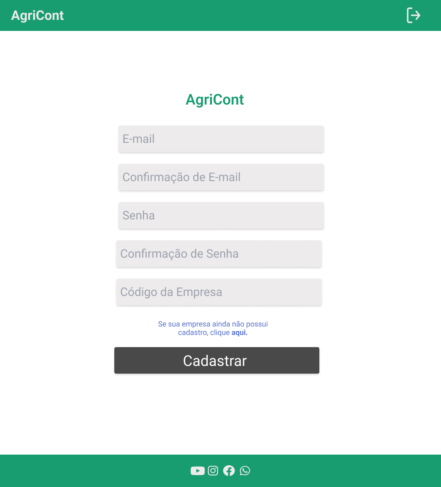
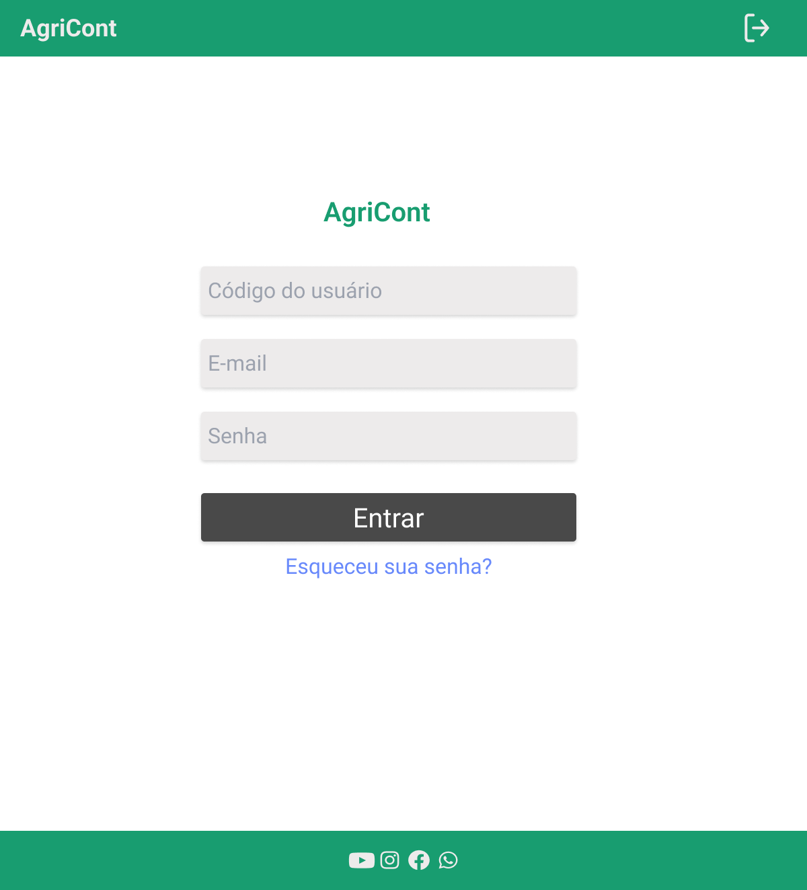
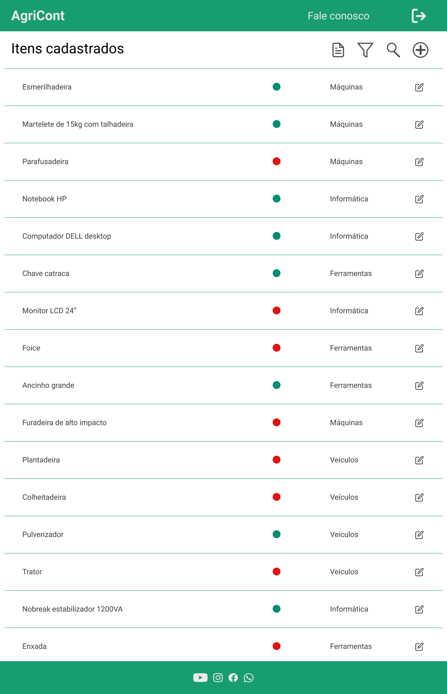
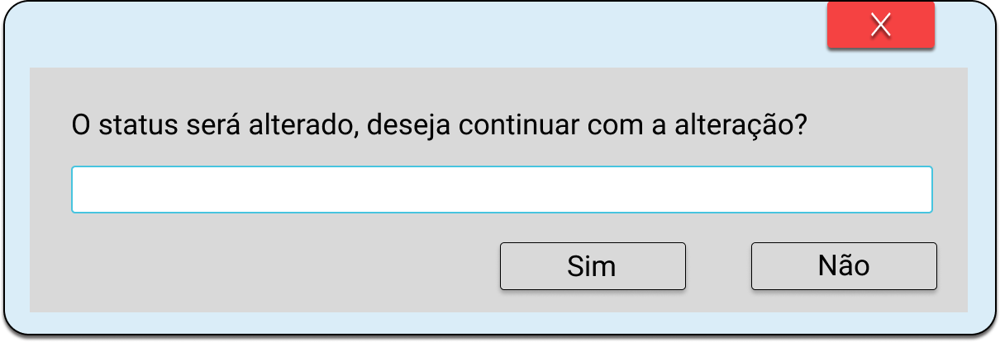
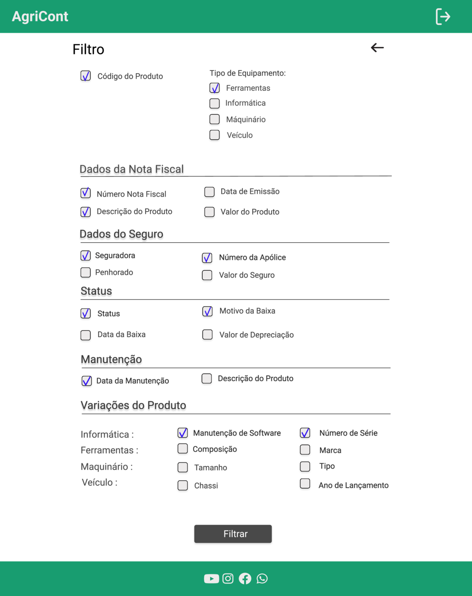
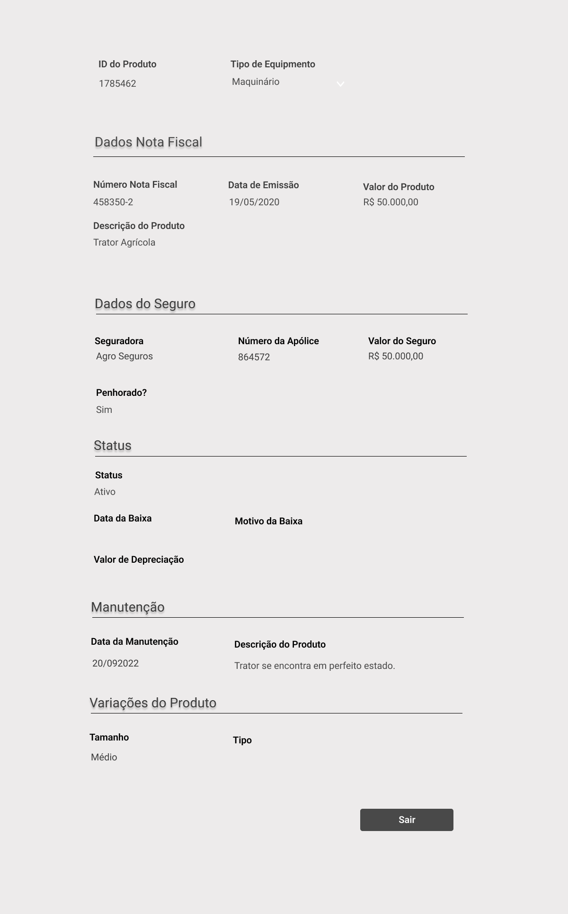

# Projeto de Interface

Pré-requisitos: <a href="2-Especificação do Projeto.md"> Documentação de Especificação</a>

Visão geral da interação do usuário pelas telas do sistema e protótipo interativo das telas com as funcionalidades que fazem parte do sistema (wireframes).

## Diagrama de Fluxo

O diagrama apresenta o estudo do fluxo de interação do usuário com o sistema interativo e  muitas vezes sem a necessidade do desenho do design das telas da interface. Isso permite que o design das interações seja bem planejado e gere impacto na qualidade no design do wireframe interativo que será desenvolvido logo em seguida.

## Wireframes

Conforme fluxo de telas do projeto, apresentado no item anterior, as telas do sistema são apresentadas em detalhes nos itens que se seguem. As telas do sistema apresentam uma estrutura comum que é apresentada na Figura X. Nesta estrutura, existem 3 grandes blocos, descritos a seguir. São eles:  

- Cabeçalho - local onde são dispostos elementos fixos de identidade (logo) e navegação principal do site (menu da aplicação);  
-	Conteúdo - apresenta o conteúdo da tela em questão;  
-	Rodapé - apresenta elementos fixos de navegação secundária.

Figura X - Estrutura Padrão do Site

## Tela de Página Inicial

Esta tela informa ao usuário a importância do controle patrimonial e os serviços disponibilizados pela Agricont. Além disso, permite o direcionamento para as páginas Fale Conosco, Cadastro e Login, de acordo com a escolha do usuário. 

## Tela de Fale Conosco
É uma ferramenta que o usuário poderá utilizar para contactar o mantenedor do site através de mensagem de texto, mas para isto será necessário preencher dados pessoais como Nome Completo, E-mail e Telefone.

## Tela de cadastro de empresas
Esta é a tela onde  serão cadastrados os dados da empresa

## Tela de Cadastro do Usuário

Esta tela permite que o usuário realize seu cadastro. Para isso deve informar e-mail, senha e código da empresa ao qual deseja se conectar.

## Tela de Login
A tela de Login abrirá após o usuário clicar no ícone de Login localizado no Cabeçalho. O usuário deverá informar e-mail, senha e clicar em entrar, após isso estará logado.

## Tela de Alteração de Senha 

Caso o usuário esqueça sua senha ele poderá alterar através desta tela.

## Tela de Itens Cadastrados

Esta tela mostra ao usuário todos os patrimônios que já foram cadastrados pelo mesmo, tendo a opção de gerar um relatório dos patrimônios, filtrar um tipo de item específico, pesquisar algum item na lista, cadastrar um novo patrimônio e editar um cadastro já existente.

## Tela de Alerta 

Esta tela será mostrada quando o usuário clicar para alterar status de ativo para inativo ou vice-versa.

## Tela de Filtro
O usuário poderá selcionar tipos de equipamentos, dados da nota fiscal, dados do seguro, status, manutenção e variações do produto para gerar o relatório.

## Tela de Informações cadastradas do item

Esta tela é exibida na forma de uma janela modal e exibe todas as informações cadastradas do item selecionado. No canto inferior direito, possui um botão para sair.  

## Tela de Cadastro de Ferramentas

Esta tela irá cadastrar os itens de ferramentaria e o que a diferencia das demais telas de cadastro são os itens que estão em "Variações do Produto" que são: Composição e Marca.

## Tela de Cadastro de Informática

Esta tela irá cadastrar os itens de informática e o que a diferencia das demais telas de cadastro são os itens que estão em  "Variações do Produto" que são: Data de Manutenção de Software e número de série.

## Tela de Cadastro de Máquinário

Esta tela irá cadastrar máquinas e o que a diferencia das demais telas de cadastro são os itens que estão em  "Variações do Produto" que são: Tipo e Tamanho.

## Tela de Cadastro de Veículo

Esta tela irá cadastrar veículos e o que a diferencia das demais telas de cadastro são os itens que estão em  "Variações do Produto" que são: número de chassi e Ano de Lançamento.

