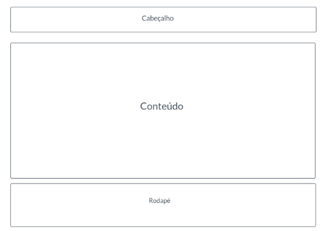

# Template Padrão da Aplicação

Pré-requisitos: <a href="2-Especificação do Projeto.md"> Especificação do Projeto</a>, <a href="3-Projeto de Interface.md"> Projeto de Interface</a>, <a href="4-Metodologia.md"> Metodologia</a>

Layout padrão da aplicação que será utilizado em todas as páginas com a definição de identidade visual, aspectos de responsividade e iconografia.

O padrão de layout a ser utilizado pelo site tem correspondência ao projeto de interface elaborado anteriormente.  As telas do sistema apresentam uma estrutura comum que é apresentada na Figura X. Nesta estrutura, existem 3 grandes blocos, descritos a seguir. São eles:  

- Cabeçalho - local onde são dispostos elementos fixos de identidade (logo) e navegação principal do site (menu da aplicação);  
- Conteúdo - apresenta o conteúdo da tela em questão;  
- Rodapé - apresenta elementos fixos de navegação secundária.

Figura X - Estrutura Padrão do Site

## Tela Página Inicial

Figura X - Tela Inicial