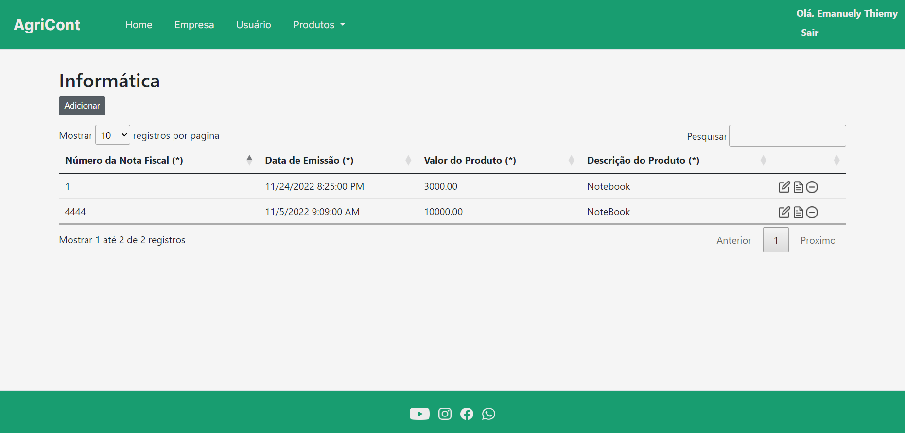
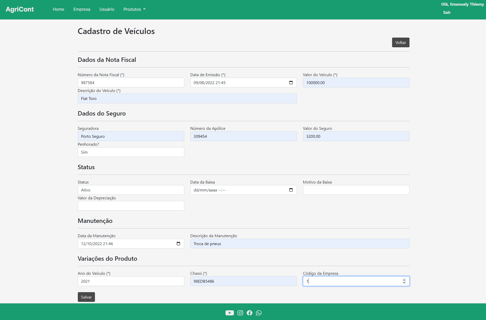
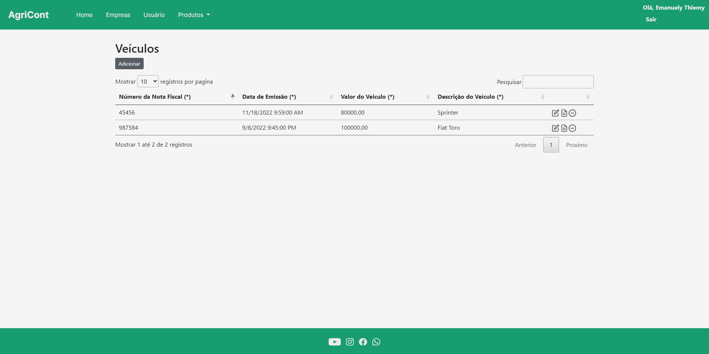
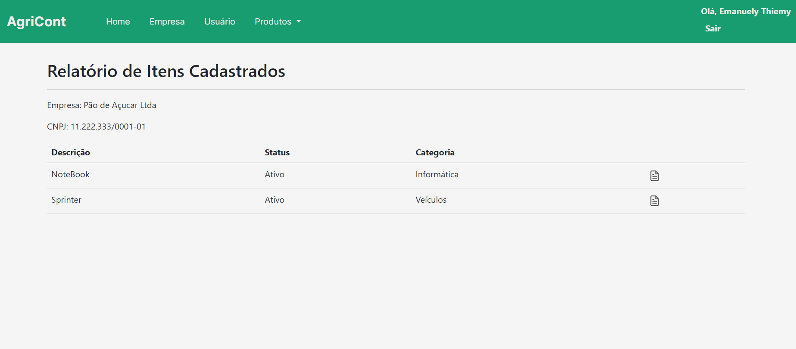
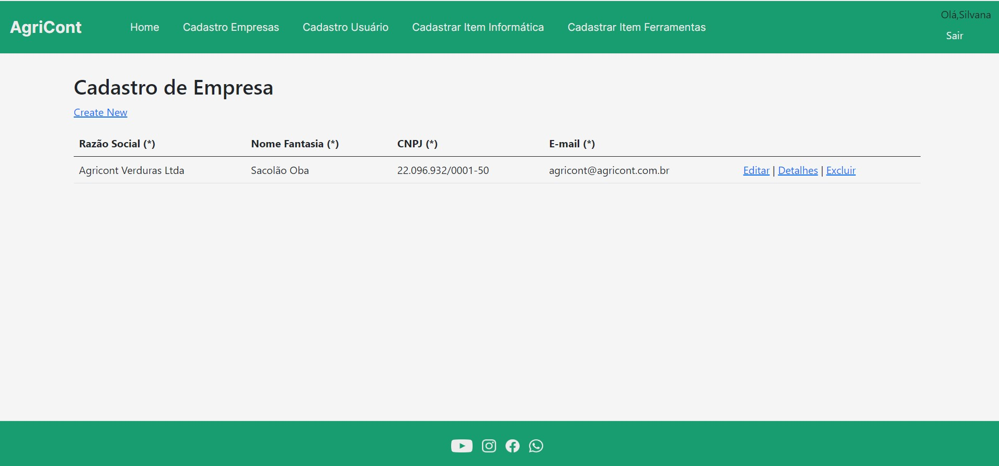

# Registro de Testes de Software

Esta seção apresenta as evidências e resultados dos testes definidos anteriormente em [Plano de Testes de Software](https://github.com/ICEI-PUC-Minas-PMV-ADS/pmv-ads-2022-2-e2-proj-int-t5-projeto-agricont/blob/main/docs/08-Plano%20de%20Testes%20de%20Software.md).

## CT-01/02/03 – Página Inicial

**Evidência do Teste:** 

**Avaliação:** A página apresenta as informações que indicam a importância do controle patrimonial e os links de "Fale Conosco" e "Cadastra-se" estão funcionando corretamenente, portanto houve êxito nos testes.

## CT-04 – Ícone de Login na Página Inicial

**Evidência do Teste:** Assista ao vídeo clicando [aqui](https://github.com/ICEI-PUC-Minas-PMV-ADS/pmv-ads-2022-2-e2-proj-int-t5-projeto-agricont/blob/main/presentation/Etapa%203%20%20Videos/ETS-CT05.mp4)

**Avaliação:** A página de login foi exibida com sucesso portanto houve êxito no teste.

## CT-05 – Efetuar Login

**Evidência do Teste:** 

Assista ao vídeo clicando [aqui](https://github.com/ICEI-PUC-Minas-PMV-ADS/pmv-ads-2022-2-e2-proj-int-t5-projeto-agricont/blob/main/presentation/Etapa%203%20%20Videos/ETS-CT06.mp4)

**Avaliação:** A aplicação permite o preenchimento de todos os campos do login e ao clicar em "Entrar" a conta do usuário foi liberado portanto houve êxito no teste.

## CT-06 – Pesquisa

**Evidências do Teste**

Assista ao vídeo clicando [aqui](https://github.com/ICEI-PUC-Minas-PMV-ADS/pmv-ads-2022-2-e2-proj-int-t5-projeto-agricont/blob/main/presentation/Etapa%204%20Videos/ETS-CT06.mp4)

**Avaliação:** Houve êxito no teste pois, pois quando digitado o número da nova fiscal , por exemplo, a busca está sendo exibida com sucesso.

## CT-07 - Tela Fale Conosco
 **Evidências do Teste**

**Avaliação:** Houve êxito no teste, pois ao preencher o formulário e clicar em enviar, os dados foram enviados para o email da AgriCont.

## CT-08 - Tela Alterar Senha
 **Evidências do Teste**

Assista ao vídeo clicando [aqui](https://github.com/ICEI-PUC-Minas-PMV-ADS/pmv-ads-2022-2-e2-proj-int-t5-projeto-agricont/blob/main/presentation/Etapa%203%20%20Videos/ETS-CT08.mp4)

**Avaliação:** Houve êxito no teste, pois ao preencher o formulário e clicar em redefinir, uma nova senha é enviada para o email do usuário.

## CT-09 – Tela Cadastro de Produto

**Evidências do Teste**

Assista ao vídeo clicando [aqui](https://github.com/ICEI-PUC-Minas-PMV-ADS/pmv-ads-2022-2-e2-proj-int-t5-projeto-agricont/blob/main/presentation/Etapa%203%20%20Videos/ETS-CT09.mp4)

**Avaliação:** Houve êxito no teste pois, após inserir os dados do produto para cadastro e clicar no botão salvar, os dados informados foram salvos no banco de dados e mostrados na tela de produtos cadastrados conforme imagem.

## CT-10 – Tela Relatório Itens Cadastrados

**Evidências do Teste**

Assista ao vídeo clicando [aqui](https://github.com/ICEI-PUC-Minas-PMV-ADS/pmv-ads-2022-2-e2-proj-int-t5-projeto-agricont/blob/main/presentation/Etapa%204%20Videos/ETS-CT10.mp4)

**Avaliação:** Houve êxito no teste pois, o relatório está sendo gerado, os dados podem ser editados e o sistema está carregando todos os cadastros de equipamentos do banco.

## CT-11 - Tela Cadastro de Empresa

**Evidências do Teste**

Assista ao vídeo clicando [aqui](https://github.com/ICEI-PUC-Minas-PMV-ADS/pmv-ads-2022-2-e2-proj-int-t5-projeto-agricont/blob/main/presentation/Etapa%203%20%20Videos/ETS-CT13.mp4)

**Avaliação:** Tivemos êxito no teste, pois ao inserir as informações da empresa e clicar em salvar, os dados persistiram no banco de dados, conforme demonstrado na foto.

 ## CT-12 - Tela Cadastro do Usuário
 **Evidências do Teste**

 

 Assista ao vídeo clicando [aqui](https://github.com/ICEI-PUC-Minas-PMV-ADS/pmv-ads-2022-2-e2-proj-int-t5-projeto-agricont/blob/main/presentation/Etapa%203%20%20Videos/ETS-CT14.mp4)

 **Avaliação:** Houve êxito no teste, pois ao inserir os dados do usuário e clicar em cadastrar, os dados foram salvos no banco de dados e mostrados na página conforme a imagem.

## Relatório
<a href="https://drive.google.com/file/d/1DEYHsIVSiydsM1N9J03Ev4elvAuv5DQ-/view?usp=sharing">Neste</a> relatório apresentamos o compilado das informações aqui apresentadas.
